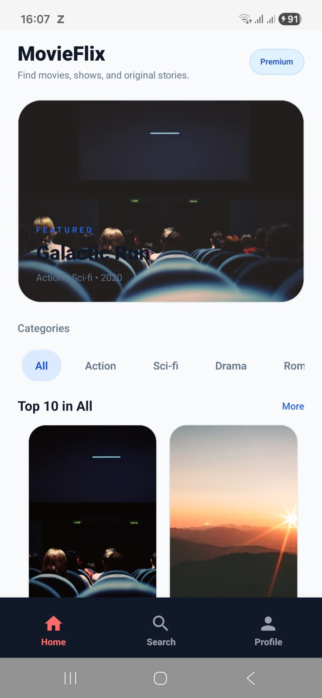
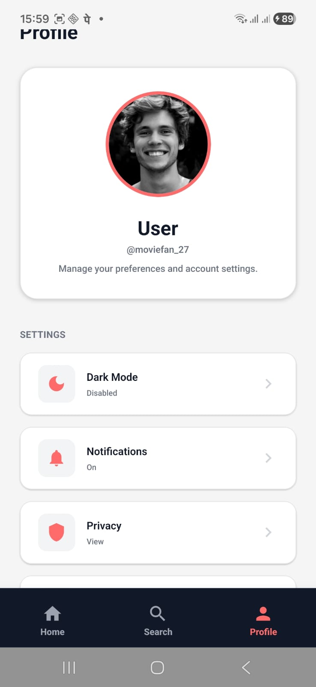
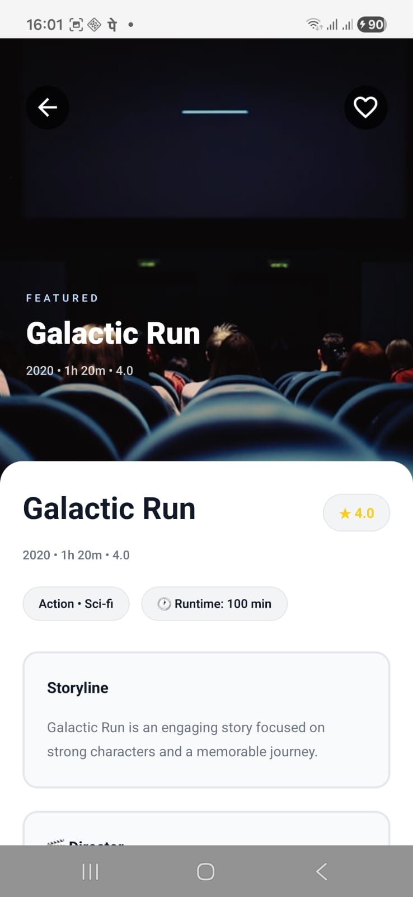
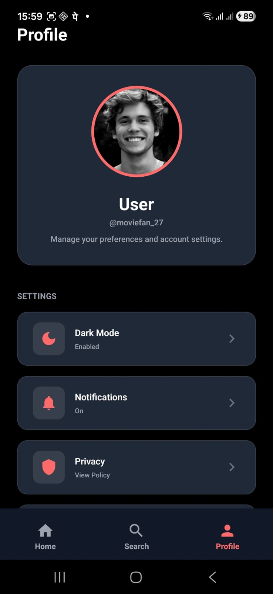

# MovieFlix Assignment

MovieFlix Assignment is a React Native movie browsing app built with Expo SDK 57, TypeScript, React Navigation, NativeWind, and React Native Paper.

The app includes a featured home experience, genre-based browsing, search, a movie details screen, and a profile screen with theme preferences.

## Features

- Featured hero section on the home screen
- Category and genre-based movie browsing
- Search by title or genre
- Movie details screen with cast, director, runtime, and related titles
- Dark mode support through a shared theme context
- Local mock movie dataset with paginated loading behavior

## Tech Stack

- Expo SDK 57
- React Native 0.86
- React 19
- TypeScript
- React Navigation
- NativeWind
- React Native Paper

## Architecture Overview

This app uses a layered React Native structure designed to keep UI, navigation, and data access separated.

- App shell: [App.tsx](App.tsx) wires Safe Area management, theming, Paper provider setup, and the navigation container.
- Navigation layer: [src/navigation/RootStack.tsx](src/navigation/RootStack.tsx), [src/navigation/BottomTabs.tsx](src/navigation/BottomTabs.tsx), and [src/navigation/HomeStack.tsx](src/navigation/HomeStack.tsx) combine native stack navigation with bottom tabs.
- Screen layer: screens are responsible for composition and user flows, not data fetching details.
- Data layer: [src/services/movieService.ts](src/services/movieService.ts) exposes an asynchronous service abstraction with artificial delay to mimic real network behavior.
- State layer: [src/hooks/useMovies.ts](src/hooks/useMovies.ts) manages loading, refresh, pagination, error handling, and data state.
- Theme layer: [src/contexts/ThemeContext.tsx](src/contexts/ThemeContext.tsx) centralizes light/dark mode state and persists it with AsyncStorage.

## Feature Mapping

- Home feed: hero banner, horizontal content rails, category filtering, continue watching, and paginated sections.
- Detail view: animated hero image, sticky/dynamic header, metadata chips, scrollable detail sections, and related content.
- Search: query-driven filtering with top picks and results.
- Profile: theme toggle, settings actions, notifications toggle, privacy link, and logout state handling.

## Design Choices

- Visual direction: a cinematic card-based layout with high-contrast surfaces, large display typography, and poster-first presentation.
- Navigation choice: native stack plus tabs gives a production-style mobile structure instead of a single-screen demo flow.
- Theming: dark mode is treated as a first-class experience and applied consistently across screens.
- Reusability: shared components such as headers, fallback images, loading states, category rows, and cards reduce duplication.
- String management: reusable text constants are centralized in [src/constants/strings.ts](src/constants/strings.ts) for maintainability.

## Performance Considerations

- Data memoization: expensive derived values such as categories, hero content, filtered lists, and metadata are memoized with `useMemo`.
- Stable callbacks: item press handlers and render functions use `useCallback` to reduce avoidable re-renders.
- Memoized rows/cards: selected list items are wrapped with `React.memo` where repeated list rendering occurs.
- Optimized lists: `FlatList` and `SectionList` are configured with `initialNumToRender`, `windowSize`, `removeClippedSubviews`, and stable `keyExtractor` values.
- Image handling: [src/components/FallbackImage.tsx](src/components/FallbackImage.tsx) uses `expo-image` with source normalization and fallback behavior.
- Progressive UX: skeleton loaders, empty states, error states, pull-to-refresh, and infinite scroll keep the UI responsive during fetch transitions.

## UI/UX Coverage

- Safe area handling is implemented with `SafeAreaProvider` and `SafeAreaView`.
- Navigation includes bottom tabs and native stacks.
- Loading, empty, and error states are present across the major data-driven screens.
- The Detail screen includes a sticky/dynamic header powered by `react-native-reanimated`.
- Theme switching is available from the Profile screen and persisted locally.

## Project Structure

```text
src/
  components/     Reusable UI pieces
  constants/      UI strings
  contexts/       App-wide theme state
  data/           Local movie dataset
  hooks/          Data loading hooks
  navigation/     Stack and tab navigators
  screens/        Home, Search, Details, Profile, CategoryList
  services/       Movie service and API fallback logic
  types/          Shared TypeScript types
  utils/          Formatting helpers
```

## Requirements

- Node.js 22.13 or newer
- npm
- For Android development on Windows:
  - Android Studio
  - Android SDK Platform 36
  - Android SDK Build-Tools
  - Android Emulator or a physical Android device
  - JDK 17

Expo SDK 57 targets React Native 0.86 and expects modern Node and Android tooling.

## Setup

1. Install dependencies:

```bash
npm install
```

2. If you want to run Android locally on Windows, make sure Android Studio is installed and configure:

```text
ANDROID_HOME=%LOCALAPPDATA%\Android\Sdk
Path += %LOCALAPPDATA%\Android\Sdk\platform-tools
```

3. Confirm ADB is available:

```bash
adb --version
```

## Run The App

Start the Expo development server:

```bash
npm run start
```

If your phone cannot connect over LAN, use tunnel mode:

```bash
npx expo start --tunnel
```

Run on Android with a local native build:

```bash
npm run android
```

Run on web:

```bash
npm run web
```

## Expo Go Usage

To run the app with Expo Go during evaluation:

```bash
npm run start
```

If the reviewer is on a different network setup or the QR code is not reachable over LAN:

```bash
npx expo start --tunnel
```

That tunnel session provides the shareable Expo Go access path needed for a live demo.

## APK / EAS Build Support

This repository now includes [eas.json](eas.json) with Android build profiles for preview APK generation and production builds.

### Preview APK

Use the preview profile when you need a directly installable APK for testing or submission review:

```bash
npx eas-cli@latest login
npx eas-cli@latest build --platform android --profile preview
```

### Production Android Build

Use the production profile for a store-style Android build:

```bash
npx eas-cli@latest build --platform android --profile production
```

### Notes

- The Android application identifier is configured in [app.json](app.json).
- The current project is prepared for EAS-based Android builds.
- After the first successful cloud build, Expo will provide an install/download link that you can place in this README or the submission form.

## Development Notes

- The current app loads movie data from the local dataset in [src/data/movies.ts](src/data/movies.ts).
- [src/services/movieService.ts](src/services/movieService.ts) includes a placeholder TMDB integration, but it is not configured with a real API key.
- The project currently uses the checked-in Android folder locally, but [.gitignore](.gitignore) is configured to ignore `/android` and `/ios` for Git.

## Submission Checklist

- Repository: GitHub source is published.
- README: setup, architecture, design, and performance notes are documented.
- Expo Go: start with `npm run start` or `npx expo start --tunnel` for a shareable live session.
- APK: buildable through the `preview` EAS profile in [eas.json](eas.json).
- Media: add screenshots or a narrated demo video link before final form submission.

## Media Placeholder

Before submission, add one of the following to this README:

- Embedded Android screenshots of Home, Search, Detail, and Profile screens
- A short narrated screen recording link covering navigation, theming, loading states, and detail interactions

## Screenshots

### Home


### Search


### Detail


### Profile


## Main Navigation

- Root stack:
  - Bottom tabs
  - Details screen
- Bottom tabs:
  - Home
  - Search
  - Profile
- Home stack:
  - Home
  - CategoryList

## Git Commands

Push this repository to GitHub:

```bash
git add .
git commit -m "Add project README"
git push -u origin main
```

If the remote is not configured yet:

```bash
git remote add origin https://github.com/arup1302/MovieFlix_Assignment.git
git push -u origin main
```

## Status

This project is ready for local development, GitHub publishing, and Expo/EAS submission preparation.